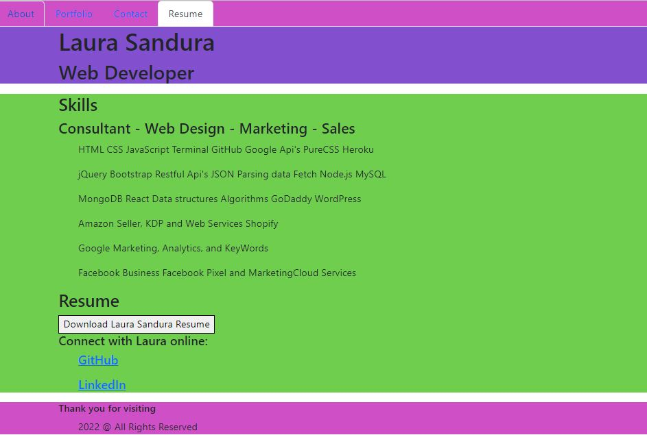

# uofa-module20-reactportfolio-lsandura
UofA-Module20-ReactPortfolio-LSandura
20th Bootcamp Module 20 Challenge completed by Laura Sandura

Main Objective: 
A single-page react application portfolio to be able to share my work and showcase to potential employers.

Challenge: 
Single-page application portfolio for web developing
Presents page header and section plus footer
Has developers name and navigations with different sections including About Me, Portfolio, Contact and Resume
The page does not reload when the navigation is clicked and does direct to correct section when clicked
About me is presented first by default with photo and short bio
The Portfolio section has at least 6 of the developers application with links to deployed app and git hub repo.
The Contact section has a form name, email and message and the form shows notification that the field is required if it is not filled in, and if the email is invalid it shows a message.
The Resume section has an option for a downloadable resume plus a list of developers skills.
The Footer section has text or icon links to developers github and linked in profiles and profile on other platforms such as Stack, Twitter, etc.

Additional Expectations:
n/a

Assignment Example 1 Picture:
    

Assignment Example 1 Picture:
    

Assignment Example 1 Picture:
    

Assignment Example 1 Picture:
    

Repository link where finalzed project can be pulled:
    https://github.com/laurabora118/UofA-Module20-ReactPortfolio-LSandura

Git Repository Site that shows finalized projectresults:
    https://laurabora118.github.io/uofa-module20-reactportfolio-lsandura/

References:
    1 - Assignment criteria received in UofA assignments
    2 - Utilized react lessons to help accomplish and refactored code
    3 - Some insights create during study group and review with a classmate
    4 - Used https://coolors.co/70ce4e to pick split color schemes selected Lime Green 70CE4E Purple 824FCF Pink CF4FC6 and 16300D Dark Green for portfolio part
    5 - Used PDF down load steps from https://www.geeksforgeeks.org/how-to-download-pdf-file-in-reactjs/
    6 - Used Canva to create favicon

MIT License:
    